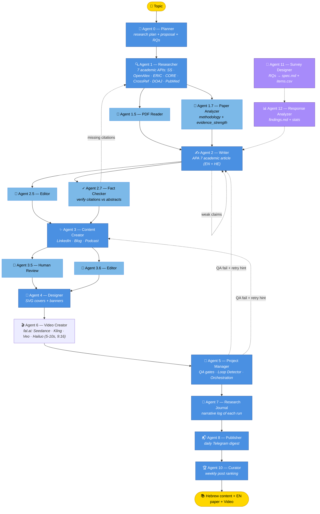

# 🦊 Moki — Education Agents Pipeline

[](https://www.python.org/)
[](https://anthropic.com/)
[](https://github.com/pazer30-jpg/education-agents)
[](https://github.com/pazer30-jpg/education-agents)
[](https://github.com/pazer30-jpg/education-agents)
[](https://github.com/pazer30-jpg/education-agents)
[](https://github.com/pazer30-jpg/education-agents)

Autonomous multi-agent system for academic research and content creation in education.
From **topic** → **academic research** → **article** → **LinkedIn post + blog + podcast**.

Generates Hebrew content with English academic sources. Built for non-formal education research.

---

## ⚡ Quick Start

```bash
# 1. Install dependencies
pip install -r requirements.txt

# 2. Configure environment + voice
cp .env.example .env                       # add your API keys
cp voice_profile.example.py voice_profile.py   # customize for your voice

# 3. Health check
bash scripts/health_check.sh

# 4. Run
python agent5_project_manager.py
# or directly:
python orchestrator.py "informal education" --content linkedin blog
```

> **Voice profile is required.** The system reads `voice_profile.py` to shape
> generated content. A template is provided in `voice_profile.example.py` —
> copy and customize before running. The real `voice_profile.py` is gitignored
> to keep personal style/bio out of the repo.

---

## 🏗 Architecture



> _Solid arrows: data flow.  Dotted arrows: reciprocal feedback (via scratchpad)._

**Supporting layers:**

- 🧠 **Memory** — `memory.py`, `obsidian_memory.py`, `scratchpad.py` · 19 markdown notes in `output/_memory/`
- 🛡 **Quality** — `qa_checker.py`, `fact_checker.py` (triangulation), `dedup_checker.py`, `injection_guard.py`
- 📊 **Observability** — `analytics.py`, `observability.py`, `dashboard.py`, `agent_health.py`, `log_router.py`
- 🎓 **Academic** — `seminar_writer.py`, `thesis_prep.py`, `bibliography.py`
- 🔁 **Learning** — `hook_log.py`, `performance_learner.py`, `failure_analyzer.py`, `voice_match.py`, `engagement_tracker.py`
- 🛰 **Distribution** — `agent8_publisher.py`, `linkedin_publisher.py`, `linkedin_analytics_import.py`
- 🔒 **Reliability** — `pipeline_lock.py`, `cost_forecaster.py`, `source_health.py`, `memory_snapshots.py`

---

## 🤖 Daily Autonomy — 12 routines

Every agent has a small daily routine that keeps the system warm between
pipeline runs. Dispatched by `autonomy.py` via launchd on the hour.

| Hour  | Routine                    | Tier   | Cost    | What it does                                              |
| ----- | -------------------------- | ------ | ------- | --------------------------------------------------------- |
| 02:00 | `retroactive_polishing`    | T3     | ~$1.00  | Re-polish recent article if humanize rules changed        |
| 02:30 | `citation_watcher`         | T2     | ~$0.30  | Re-verify orphan citations vs fresh corpus                |
| 03:00 | `corpus_refresh`           | **T1** | $0      | Fetch 3-5 fresh papers per strong topic                   |
| 03:30 | `injection_watch`          | **T1** | $0      | Symmetry Test scan of fresh external content              |
| 04:00 | `trend_mapping`            | T2     | ~$0.30  | Synthesize trends from 14-day corpus growth               |
| 05:00 | `repurposer`               | T3     | ~$1.00  | Repurpose 90+ day old article to fresh LinkedIn           |
| 06:00 | `topic_radar`              | **T1** | $0      | Queue tomorrow's topics (series-aware)                    |
| 06:00 | `curator_dynamic_priority` | **T1** | $0      | Refresh weekly post ranking                               |
| 06:30 | `outline_prewarm`          | T2     | ~$0.50  | Outline tomorrow's #1 queued topic (saves cron 10min)     |
| 09:30 | `weekly_meta_synthesis`    | T2     | ~$0.40  | Reflective journal entry (Mondays only)                   |
| 11:00 | `engagement_refresher`     | **T1** | $0      | Auto-import LinkedIn CSV from ~/Downloads                 |
| 23:00 | `visual_backlog`           | T3     | ~$0.80  | Generate SVG cover for an uncovered article               |

Set `MOKI_AUTONOMY_TIER=1` (default) to run only the $0 routines.
T2 adds ~$1.50/day, T3 adds ~$2.00/day.

Each routine reports to `output/_state/autonomy_log.json` and surfaces in
`output/_memory/active_alerts.md` so failures are visible from the next
pipeline's memory load.

---

## 🛡 Prompt Injection Defense

External content (paper abstracts, trending titles, CSV rows) is **DATA, not
instructions**. The `injection_guard` module provides three defensive layers:

1. **SYMMETRY_TEST** — a 382-char Hebrew system-prompt fragment injected into
   every content-generating agent. Asks the model: "Would I write this if
   the source hadn't told me to?"
2. **Nightly scan** at 03:30 — regex scanner flags injection markers
   (`ignore previous instructions`, `act as …`, role-tag mimicry, base64,
   obfuscation) and surfaces hits in `active_alerts.md`.
3. **Citation whitelist + triangulation** in `agent2_7_fact_checker.py` —
   final verification layer at output.

---

## 🔬 Primary Research — Agents 11 + 12

Beyond reviewing existing literature, the system can conduct empirical
surveys grounded in established theoretical frameworks (Hobfoll, CD-RISC,
McAdams, Erikson, Hagerty & Patusky Belonging, etc.).

```bash
# Phase 1: design a survey from research questions
python3 agent11_survey_designer.py \
    --topic "loneliness in boarding-school principals" \
    --rq "What predicts resilience among isolated principals?" \
    --rq "How do principals describe their support networks?" \
    --audience "boarding-school principals in Israel" \
    --frameworks Hobfoll CD-RISC --estimated-n 80

# → output/surveys/<slug>/spec.md   (methodology)
# → output/surveys/<slug>/items.csv  (upload to Google Forms)

# Phase 2: analyze responses
python3 agent12_response_analyzer.py \
    --slug loneliness-in-boarding-school-principals \
    --responses ~/Downloads/responses.csv
# → findings.md (descriptives, Cronbach α, correlations, qualitative themes)
```

Total cost per full survey: ~$2.40 (1 design call + ≤3 coding calls).

Findings feed directly into the Writer — the next article becomes
"Mixed Methods Findings" instead of "Literature Review" with real n.

---

## 🤝 Inter-Agent Communication

Agents talk to each other through `scratchpad.py` (transient, per-run) and Obsidian memory notes (persistent).

```text
fact_checker        → researcher        (missing citations → next searches)
causal_validator    → writer            (strong claims → soften)
conflict_resolver   → writer            (surface contradictions)
qa_checker          → next agent        (failure reason in retry prompt)
analytics           → agent0_planner    (strong/weak topics)
edit_tracker        → agent2_5_editor   (learned correction patterns from user edits)
active_response     → agent3            (observability alerts → behavior change)
```

---

## ⚙️ Configuration

```bash
cp .env.example .env
```

| Variable | Required | Description |
|---|---|---|
| `ANTHROPIC_API_KEY` | Only without Claude CLI | Direct API access |
| `TELEGRAM_BOT_TOKEN` | No | Failure/success notifications |
| `TELEGRAM_CHAT_ID` | No | Notification destination |
| `SEMANTIC_SCHOLAR_API_KEY` | No | Improved rate limits |
| `UNPAYWALL_EMAIL` | Yes | Access to open-access PDFs |
| `MOKI_AUTONOMY_LEVEL` | No (default: 1) | 0=ask all gates, 1=trust me, 2=full |
| `MOKI_AUTONOMY_TIER` | No (default: 1) | Daily-routine ceiling: 1=$0/day, 2=+$1.50, 3=+$2.00 |
| `MOKI_DAILY_BUDGET` | No (default: 75) | Daily Claude budget cap in USD |
| `MOKI_DEEP_HUMANIZE` | No | `1` enables self-audit loop in Article Editor |
| `FAL_KEY` | No (skip Agent 6 without it) | fal.ai key for video generation |
| `LINKEDIN_CLIENT_ID` | No | Enables auto-publish via `mark_published.py` (see `launchd/LINKEDIN_SETUP.md`) |
| `LINKEDIN_CLIENT_SECRET` | No | OAuth secret paired with above |
| `LINKEDIN_ACCESS_TOKEN` | Auto | Populated by `python3 linkedin_publisher.py --auth` |
| `LINKEDIN_REFRESH_TOKEN` | Auto | Populated by `--auth`; auto-refreshed on 401 |
| `LINKEDIN_USER_URN` | Auto | Populated by `--auth` from `/v2/userinfo` |

> **Claude CLI vs API Key:** The system prefers `claude` CLI (subscription).
> Falls back to `ANTHROPIC_API_KEY` if CLI is unavailable.

---

## 🚀 Running Modes

```bash
# Full pipeline (recommended — via Agent 5)
python agent5_project_manager.py

# Force full pipeline with all 5 agents (MAX mode)
python agent5_project_manager.py "full pipeline — topic X"

# Direct pipeline
python orchestrator.py "topic" --content linkedin blog podcast

# Research only
python agent1_researcher.py

# Content from existing article
python agent3_content_creator.py --from-article output/articles/my_article.md

# Academic writing (long form)
python seminar_writer.py --topic "X" --papers output/thesis/<stamp>/papers_full.json --target-words 12000
python thesis_prep.py "topic"
python thesis_lit_collector.py "topic" --target 300

# Video generation (Agent 6 — requires FAL_KEY)
python agent6_video_creator.py --auto-latest linkedin --model=seedance_lite

# Autopilot (autonomous)
python autopilot.py
```

---

## 📁 Folder Structure

```text
education-agents/
├── agent0_planner.py            # Agent 0 — research planning
├── agent1_researcher.py         # Agent 1 — academic search
├── agent2_writer.py             # Agent 2 — article writing
├── agent3_content_creator.py    # Agent 3 — multi-platform content
├── agent4_designer.py           # Agent 4 — visual design
├── agent5_project_manager.py    # Agent 5 — orchestrator + QA
├── orchestrator.py              # Direct pipeline runner
├── claude_cli.py                # Claude wrapper (CLI + API fallback)
│
├── scripts/
│   ├── health_check.sh          # Pre-run health gate
│   ├── clean_cache.sh           # Cache cleanup
│   └── pipeline_stats.sh        # Performance stats
│
├── output/                      # Obsidian Vault — generated content
│   ├── ready/{linkedin,blog,podcast}/   # Approved for publishing
│   ├── articles/                # Academic articles
│   ├── papers/                  # Collected PDFs (gitignored)
│   ├── _memory/                 # Moki's active memory (gitignored)
│   └── thesis/<stamp>/          # Thesis preparation outputs
│
├── requirements.txt
├── .env.example
└── README.md
```

---

## 🔧 Useful Scripts

```bash
# Pre-run health check
bash scripts/health_check.sh

# Pipeline performance stats
bash scripts/pipeline_stats.sh

# Cache cleanup
bash scripts/clean_cache.sh
```

---

## 🐛 Common Issues

| Error | Solution |
|---|---|
| `Claude CLI not available and no ANTHROPIC_API_KEY` | Set `ANTHROPIC_API_KEY` in `.env` |
| `writer hard timeout — exceeded N min` | Topic too complex — reduce subtopics or use `--smart` mode |
| `'>=' not supported between instances of 'str' and 'int'` | Fixed in current version |
| Pipeline stuck for over an hour | Run `bash scripts/health_check.sh` to verify CLI |
| `DailyBudgetExceeded` | Raise with `export MOKI_DAILY_BUDGET=50` |

---

## 📊 Current State

```bash
bash scripts/pipeline_stats.sh
python agent_health.py            # Per-agent health card
python failure_analyzer.py        # Failure pattern detection
python performance_learner.py     # Top vs bottom content patterns
```

---

## 🗺 Complete Code Map

See [`output/_INDEX.md`](output/_INDEX.md) — auto-regenerated by `regenerate_index.py`.

---

## 🌍 Note on Language

The system generates content **in Hebrew** (the user's primary language), citing **English academic sources**.
This README, code comments, and docstrings are in English for accessibility.
The voice profile, system prompts, and Obsidian memory remain in Hebrew — they encode user preferences.

---

## 🎬 Demo

To capture a demo of the system in action:

```bash
# Record terminal session (macOS — installs once)
brew install asciinema agg

# Record a typical run (small example)
asciinema rec demo.cast -c "python agent5_project_manager.py 'belonging research'"

# Convert to animated GIF
agg demo.cast demo.gif --speed 2

# Or use the dashboard for a static screenshot
moki-dash    # opens output/dashboard.html in browser
```

Then add `demo.gif` to the repo root and reference it here.

---

## 📊 Engineering Highlights

What makes this project technically interesting:

- **13-agent pipeline** with optional gates, retries, and loop detection
- **8 reciprocal feedback channels** between agents via shared scratchpad
- **Obsidian-as-memory** — agent prompts read user-editable markdown files
- **3-tier classification** for file organization (frontmatter → rules → Claude fallback)
- **Atomic checkpointing** with SHA256 hash validation + .bak rolling
- **Daily budget cap** with environment override + hard halt
- **Hebrew-aware** — RTL rendering, rule-based lemmatization, mixed-script regex
- **APA 7 generation** with proper author formatting + sorted bibliography
- **Pre-generation outline gate** — catches weak outputs before $$ is spent
- **Auto-organizer** — keeps Obsidian vault tidy by file type
- **Performance learner** — top 20% vs bottom 20% pattern extraction

---

## 📄 License

Personal research project. Not currently licensed for redistribution.
